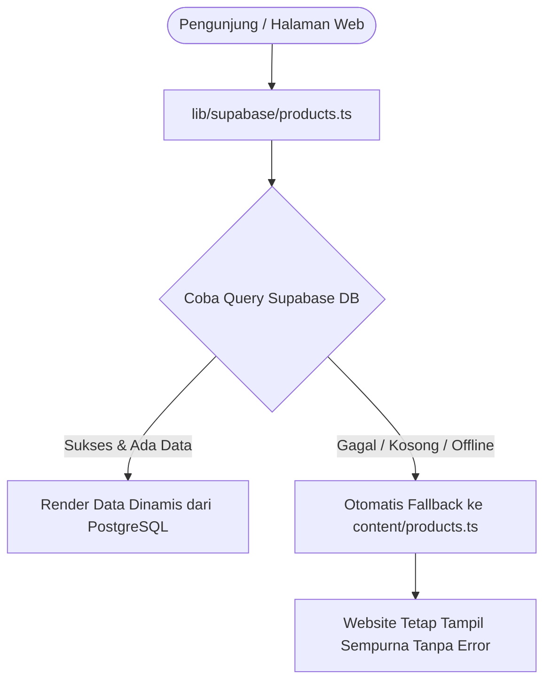

# PANDUAN ARSITEKTUR TEKNIS, TECH STACK & STRUKTUR KONTEN
**euphoric.disorder — Streetwear Kriminologi & Custom Sablon Apparel**
*Dokumen Spesifikasi Komprehensif Sistem, Frontend, Backend, dan Manajemen Konten*

---

## 1. Ringkasan Proyek & Filosofi Brand

**euphoric.disorder** adalah brand streetwear independen asal Kemayoran, Jakarta Pusat yang menggabungkan 3 pilar utama:
> **"Comedy · Criminologist · Creativity"**  
> *"Kejahatan sebagai bahan kajian. Kaos sebagai medium."*

Website ini berfungsi sebagai:
1. **Showcase Interaktif & E-Commerce Catalog**: Menampilkan koleksi kaos Boxy Oversized dan hoodie bertema kriminologi dengan model 3D interaktif.
2. **Kanal Konversi & Kustom Sablon**: Formulir inquiry kontak dan kustom sablon apparel satuan/batch yang terhubung langsung ke WhatsApp.
3. **Pusat Komando Mandiri (Admin Console "Markas Besar")**: Dashboard internal single-owner untuk mengelola seluruh katalog produk, stok, harga, jam operasional, FAQ, dan pesan masuk tanpa menyentuh kode.

---

## 2. Stack Teknologi Lengkap (Technology Stack)

Proyek ini dibangun menggunakan arsitektur **Next.js Monorepo Tunggal** (website publik dan panel admin berada dalam satu repositori dan satu deployment Vercel).

```
+----------------------------------------------------------------------------------------------------+
|                                    NEXT.JS 14 MONOREPO ARCHITECTURE                               |
+--------------------------------------------------+-------------------------------------------------+
| CLIENT-SIDE / INTERACTIVITY                      | SERVER-SIDE / ENGINE                            |
| • React 18.3                                     | • Next.js 14.2 (App Router)                     |
| • Three.js 0.169 & React Three Fiber (R3F)       | • React Server Components (RSC)                 |
| • @react-three/drei (GLTF Loader, Orbit Controls)| • Next.js Server Actions (Mutations & DB CRUD)  |
| • GSAP 3.15 & Framer Motion 12.4                 | • Next.js Middleware (Auth Session Guard)       |
| • Lenis 1.3 (Inertial Smooth Scroll Engine)      | • @supabase/ssr (Cookie-based Sessions)         |
| • Tailwind CSS 3.4 + Custom Tokens               | • Node.js runtime                               |
+--------------------------------------------------+-------------------------------------------------+
|                                   BACKEND-AS-A-SERVICE (SUPABASE)                                  |
| • PostgreSQL Database with Row Level Security (RLS) & Triggers                                     |
| • Supabase Storage CDN (Bucket: product-images, site-assets)                                       |
| • Supabase Auth (Email & Password, Secure HTTP-only cookies)                                       |
+----------------------------------------------------------------------------------------------------+
```

### 2.1 Frontend & Rendering Engine
- **Framework**: [Next.js 14.2.15](https://nextjs.org/) menggunakan **App Router** (`app/`).
  - Menggabungkan **React Server Components (RSC)** untuk performa SEO maksimal dan *Zero Client JavaScript* pada data statis.
  - Komponen interaktif menggunakan directive `"use client"` secara granular.
- **Bahasa**: [TypeScript 5.6](https://www.typescriptlang.org/) dengan konfigurasi *strict mode*.
- **Styling**: [Tailwind CSS 3.4.13](https://tailwindcss.com/) yang dipetakan langsung ke CSS Variables di [styles/tokens.css](file:///c:/Users/USER/Downloads/euphoric.disorder%20website/euphoric.disorder/styles/tokens.css).
- **Animasi & Interaktivitas 3D**:
  - **Three.js** (`three@0.169.0`) + **@react-three/fiber** (`8.17.10`) + **@react-three/drei** (`9.114.3`): Merender file 3D model kaos `public/oversized_t-shirt.glb` secara interaktif di canvas hero section.
  - **Lenis** (`lenis@1.3.25`): Mesin *smooth-scrolling* inersia yang mengontrol scroll halaman tanpa merusak aksesibilitas native browser.
  - **GSAP** (`gsap@3.15.0`) & **Framer Motion** (`framer-motion@12.42.2`): Animasi transisi section, scroll triggers, dan micro-interactions.
- **Client-side Utilities**:
  - `browser-image-compression@2.0.2`: Mengompres foto produk secara client-side di browser menjadi format WebP berukuran < 1MB sebelum diunggah ke storage.
  - `date-fns@4.4.0`: Formatting timestamp lokal Indonesia (WIB).

### 2.2 Backend, Database & Storage (Supabase)
- **Database**: PostgreSQL di [Supabase Cloud](https://supabase.com).
- **Session & Auth Management**: `@supabase/ssr@0.12.6` + `@supabase/supabase-js@2.110.4`.
  - Menggunakan **Cookie-based Session** (bukan `localStorage`), sehingga sesi admin aman dari serangan XSS dan langsung terbaca oleh Next.js Server Components dan Middleware.
- **Security**: **Row Level Security (RLS)** aktif di semua tabel:
  - Pengunjung publik: hanya diizinkan membaca (`SELECT`) produk berstatus `is_published = true`, membaca `site_config`, membaca `faqs`, dan membuat pesan baru (`INSERT` on `contact_submissions`).
  - Admin terautentikasi: memiliki hak akses penuh (`ALL: SELECT, INSERT, UPDATE, DELETE`).
- **Media Storage**: Supabase Storage Buckets:
  - `product-images` (Public): Foto tampak depan, tampak belakang, dan detail close-up kain/sablon.
  - `site-assets` (Public): Logo, mockup, dan aset editorial.

---

## 3. Design System: "READY DESIGN" & Forensic Theme

Design system website ini berakar dari rancangan Figma **"READY DESIGN"** yang mengusung tema *Forensic Crime Investigation & Brutalist Streetwear Luxury*.

### 3.1 Token Warna & Surface Flipping (`tokens.css` & `tailwind.config.ts`)

Sistem warna menggunakan mekanisme **Surface Flipping**: warna halaman berpindah secara halus saat user menggulir (*scroll*) antar section dengan bantuan atribut `[data-surface="light|dark"]`.

```css
/* Palet Mentah */
--paper:        #FCFCFA;   /* Background terang arsip */
--ink:          #282C20;   /* Teks / elemen gelap di atas terang */
--forest:       #2C3221;   /* Hijau zaitun gelap (kartu bukti) */
--forest-deep:  #21261A;   /* Hitam-hijau pekat (background command center) */
--bone:         #EDEBDD;   /* Teks krem dokumen di atas gelap */
--bone-dim:     #B8B8A6;   /* Teks sekunder / label telemetri */
--lime:         #CDFF00;   /* Aksen neon pita police line */
--lime-deep:    #A9D400;   /* Lime versi kontras tinggi untuk di atas background terang */
```

| Token Semantik | `data-surface="light"` (Publik Default) | `data-surface="dark"` (Section Gelap & Admin) |
|---|---|---|
| `bg` | `--paper` (`#FCFCFA`) | `--forest` / `--forest-deep` (`#21261A`) |
| `fg` | `--ink` (`#282C20`) | `--bone` (`#EDEBDD`) |
| `fg-dim` | `--ink-dim` (`#6E7161`) | `--bone-dim` (`#B8B8A6`) |
| `accent` | `--lime-deep` (`#A9D400`) | `--lime` (`#CDFF00`) |

### 3.2 Tipografi Resmi Brand

Empat font khusus diload via `next/font/local` dan Google Fonts di [app/fonts.ts](file:///c:/Users/USER/Downloads/euphoric.disorder%20website/euphoric.disorder/app/fonts.ts):

| Font Family | Nama Font | Penggunaan Spesifik |
|---|---|---|
| `font-display` | **Nohemi** | Wordmark brand, display heading besar, judul artikel produk, nomor angka metrik di dashboard. |
| `font-serif` | **PT Serif** | Editorial tagline, aksen kutipan narasi, filosofi investigasi ("OUR PROFILE / PRODUCT"). |
| `font-mono` | **Space Mono** | Kode arsip kasus (`ED-CASE-XXX`), spesifikasi kain, jam WIB real-time, koordinat GPS, tabel ukuran. |
| `font-brush` | **Permanent Marker** | Stempel bukti forensik (`[EVIDENCE ARCHIVE]`, `[CASE VERIFIED]`, `[CONFIDENTIAL]`). |

---

## 4. Struktur Folder & Monorepo Codebase

```
euphoric.disorder/
├── app/                              # Next.js App Router (Rute & Layouts)
│   ├── layout.tsx                    # Root Layout (Fonts, Global CSS, Metadata SEO, JSON-LD)
│   ├── page.tsx                      # Homepage publik (Hero 3D, Catalog Grid, Profile, Contact)
│   ├── product/
│   │   ├── page.tsx                  # Halaman daftar seluruh produk publik
│   │   └── [slug]/
│   │       └── page.tsx              # Halaman detail produk (Gallery, Specs, Size Chart, Order WA)
│   ├── about/page.tsx                # Halaman profil brand & filosofi kriminologi
│   ├── contact/page.tsx              # Halaman formulir kontak & FAQ publik
│   ├── actions/
│   │   └── admin/                    # Server Actions untuk operasi database aman
│   │       ├── auth.ts               # Login / Logout admin, sesi cookie
│   │       ├── products.ts           # CRUD produk & switch Live/Draft
│   │       ├── messages.ts           # Manajemen pesan masuk & update status
│   │       ├── faqs.ts               # Tambah, edit, reorder FAQ
│   │       └── settings.ts           # Update konfigurasi situs di database
│   └── admin/                        # Panel Admin "Markas Besar"
│       ├── login/                    # Terminal Login forensik
│       └── (dashboard)/              # Route group admin dengan shell navigasi
│           ├── layout.tsx            # Admin layout (proteksi sesi + AdminShell)
│           ├── page.tsx              # Command HUD Dashboard (Ringkasan statistik)
│           ├── produk/               # Katalog bukti produk & editor berkas
│           │   ├── page.tsx          # Tabel barang bukti produk
│           │   ├── baru/page.tsx     # Form pendaftaran artikel baru
│           │   └── [slug]/edit/page.tsx # Form edit berkas perkara
│           ├── pesan/                # Kotak masuk transmisi pesan & detail
│           ├── faq/page.tsx          # Kelola FAQ
│           ├── pengaturan/page.tsx   # Konfigurasi toko, jam operasional, WA
│           ├── media/page.tsx        # Vault penyimpanan media Supabase CDN
│           └── aktivitas/page.tsx    # Log audit investigasi admin
├── components/                       # Komponen UI Reusable
│   ├── admin/                        # Komponen khusus Admin Console
│   │   ├── AdminShell.tsx            # Frame utama (Sidebar + Topbar HUD jam WIB)
│   │   ├── ProductListTable.tsx      # Tabel produk dengan skala milimeter
│   │   ├── FormProduk.tsx            # Form master produk 6 section
│   │   ├── EditorTabelUkuran.tsx     # Matriks ukuran Boxy S-XXL
│   │   ├── EditorWarnaRepeater.tsx   # Color swatches picker
│   │   ├── InputTag.tsx              # Tag input untuk kategori & sablon
│   │   ├── MessageInbox.tsx          # Kotak transmisi pesan
│   │   ├── MessageDetailView.tsx     # Detail pesan + 1-klik WhatsApp dispatch
│   │   ├── FaqManager.tsx            # Accordion FAQ manager
│   │   ├── SettingsForm.tsx          # Form konfigurasi 3 tab
│   │   ├── MediaLibrary.tsx          # Vault media dengan WebP converter
│   │   ├── PemilihMedia.tsx          # Modal pemilih foto produk
│   │   └── ActivityLogViewer.tsx     # Viewer log audit dengan diff visual
│   ├── seo/                          # Komponen SEO & Structured Data (JSON-LD)
│   └── (public components)/          # Navbar, Footer, TShirtCanvas3D, dll.
├── content/                          # Static Fallback Data (Jika DB belum terhubung)
│   ├── products.ts                   # Data default 8 produk awal
│   ├── site.ts                       # Data konfigurasi default situs
│   └── faqs.ts                       # Data default pertanyaan umum
├── lib/
│   └── supabase/                     # Supabase Client initializers
│       ├── client.ts                 # Browser client (untuk upload storage)
│       ├── server.ts                 # Server component client
│       ├── middleware.ts             # Middleware helper
│       ├── types.ts                  # TypeScript definitions database schema
│       ├── products.ts               # Data fetcher produk publik (DB fallback ke static)
│       └── site.ts                   # Data fetcher setting situs publik
├── styles/
│   ├── globals.css                   # Global layer Tailwind & base typography
│   └── tokens.css                    # Definisi tokens warna & variabel CSS resmi
├── supabase/
│   └── migrations/                   # Script migrasi database SQL
│       ├── 001_create_admin_tables.sql # Pembuatan seluruh tabel, RLS, dan triggers
│       └── 002_seed_products.sql       # Pengisian 8 produk streetwear awal & config
├── middleware.ts                     # Next.js Route Guard untuk `/admin/*`
├── tailwind.config.ts                # Konfigurasi Tailwind terintegrasi tokens.css
└── HANDOFF.md                        # Panduan serah terima proyek untuk klien
```

---

## 5. Struktur Data & Skema Database (PostgreSQL)

Database menggunakan 5 tabel inti:

### 5.1 Tabel `products` (Katalog Barang Bukti)
Menyimpan seluruh spesifikasi artikel streetwear:
- `id` (UUID, Primary Key)
- `slug` (VARCHAR, Unique) — URL slug (contoh: `warondrugs-m15`).
- `name` (VARCHAR) — Nama artikel kaos/hoodie.
- `subject` (VARCHAR) — Nomor subjek kasus (contoh: `001`).
- `case_id` (VARCHAR) — Nomor berkas (contoh: `ED-CASE-001`).
- `tagline` (VARCHAR) — Slogan ringkas artikel.
- `material` (VARCHAR) — Bahan kain (contoh: `Cotton Combed 24s`).
- `price_idr` (INTEGER) — Harga jual utama (contoh: `145000`).
- `original_price_idr` (INTEGER, Nullable) — Harga coret diskon.
- `status` (VARCHAR: `'OPEN' | 'PO' | 'LIMITED' | 'SOLD' | 'ARCHIVED'`).
- `filed_under` (TEXT[]) — Tag kategori (contoh: `["War on Drugs", "T-Shirt"]`).
- `description` (TEXT) — Ringkasan 1-2 kalimat untuk kartu preview.
- `story` (TEXT) — Narasi mendalam filosofi desain / kritik sosial.
- `fabric_gsm` (INTEGER) — Gramasi kain (contoh: `185`).
- `fabric_composition` (VARCHAR) — Komposisi (contoh: `100% Cotton Combed`).
- `fabric_feel` (VARCHAR) — Handfeel kain.
- `fit_silhouette` (VARCHAR) — Siluet (contoh: `Boxy Oversized Fit`).
- `print_technique` (VARCHAR) — Teknik sablon (contoh: `Plastisol Screen Printing`).
- `print_location` (TEXT[]) — Titik sablon (`["Dada Depan", "Punggung"]`).
- `image_front` (TEXT) — URL foto tampak depan.
- `image_back` (TEXT, Nullable) — URL foto tampak belakang.
- `image_details` (TEXT[]) — Array URL foto detail close-up.
- `colors` (JSONB) — Array variasi warna `[{ "name": "Pitch Black", "hex": "#121212" }]`.
- `sizes_available` (TEXT[]) — Ukuran tersedia `["S", "M", "L", "XL", "XXL"]`.
- `size_chart` (JSONB) — Matriks tabel ukuran `{ size, chest, length, sleeve }`.
- `care_instructions` (TEXT[]) — Petunjuk pencucian dan perawatan baju.
- `batch_info` (VARCHAR) — Status batch (contoh: `Katalog Reguler — Ready Stock`).
- `model_info` (VARCHAR) — Info model fitting.
- `shopee_url` (TEXT, Nullable) — Tautan belanja marketplace.
- `is_published` (BOOLEAN) — Status siaran publik (`true` = live, `false` = draft).
- `sort_order` (INTEGER) — Urutan display di katalog.

### 5.2 Tabel `contact_submissions` (Transmisi Pesan Masuk)
- `id` (UUID, Primary Key)
- `name`, `contact` (Email / No WhatsApp), `subject`, `message`, `source`.
- `status` (`'unread' | 'read' | 'responded' | 'archived'`).
- `admin_notes` (TEXT) — Catatan internal tindak lanjut pesanan.

### 5.3 Tabel `faqs` (Tanya Jawab Publik)
- `id` (UUID), `question`, `answer`, `sort_order`, `is_visible`.

### 5.4 Tabel `site_config` (Konfigurasi Markas)
Menyimpan konfigurasi dinamis dalam bentuk key-value:
- `whatsapp_number`, `whatsapp_base`, `whatsapp_hours`, `wa_general_message`
- `address`, `maps_url`, `city`, `est`
- `instagram`, `threads`, `shopee_url`
- `name`, `wordmark`, `tagline`, `thesis`

### 5.5 Tabel `admin_activity_log` (Log Audit Investigasi)
Mencatat seluruh aksi admin secara otomatis via Supabase triggers:
- `user_email`, `action` (`CREATE`, `UPDATE`, `DELETE`), `entity_type`, `entity_id`, `changes` (JSONB diff nilai lama vs nilai baru).

---

## 6. Alur Pengambilan Data: Resilient Dual-Layer Architecture

Untuk memastikan website **tidak pernah down** sekalipun database Supabase sedang *maintenance* atau belum terhubung, website menggunakan sistem **Dual-Layer Data Fetching**:



Arsitektur ini menjamin tingkat keandalan (*high availability*) sebesar 99.9% bagi pengalaman pengguna akhir.
